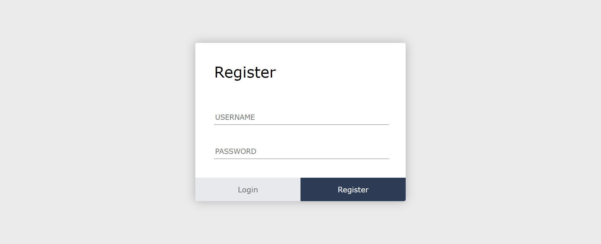
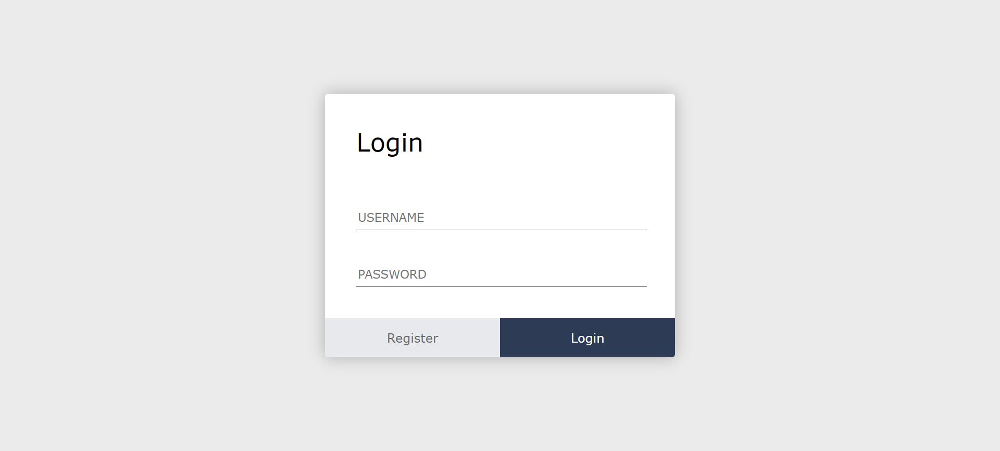
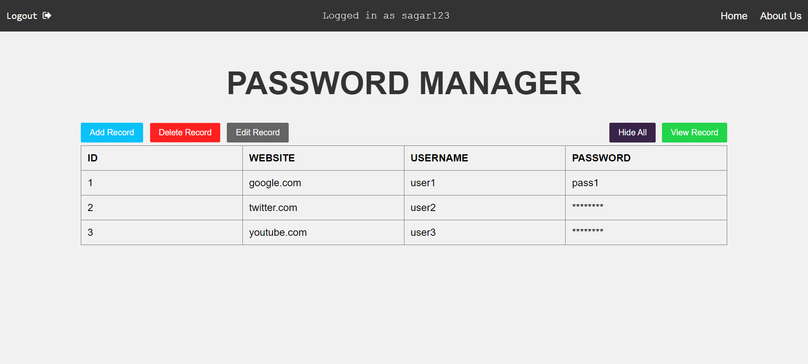

# Password Manager Web App

This is a Django-based web application for securely storing and managing passwords. It allows users to add, view, edit, and delete password records.

## Prerequisites

Before running the application, make sure you have the following prerequisites installed:

- Python (version 3.x)
- Django (version 3.x)
- SQLite3

## Getting Started

1. Clone the repository or download the source code files.
2. Navigate to the project directory using the command line.
3. Install the required Python dependencies by running the following command:
```
pip install django sqlite3 bcrypt cryptography
```
4. Create the SQLite database(if it doesn't exists) by running the following command:
```
python manage.py migrate
```
5. Start the development server by running the following command:
```
python manage.py runserver
```
6. Open your web browser and visit `http://localhost:8000` to access the Password Manager web app.

## Features

The Password Manager web app provides the following features:

1. **Login**: Users can enter a master password to access their password records.
2. **Add Record**: Users can add new password records by providing the site, username, and password details.
3. **View Records**: Users can view a list of all password records, with the password field hidden by default.
4. **Edit Record**: Users can edit existing password records, including updating the site, username, and password.
5. **Delete Record**: Users can delete password records they no longer need.
6. **Encryption**: The app uses encryption to securely store and retrieve password data from the database.

## Usage

1. **Setting the Master Password**: When you access the application for the first time, you will be prompted to set a master password. This password will be used to encrypt and decrypt your password records.

2. **Logging In**: After setting the master password, you will be redirected to the login page. Enter the master password to access your password records.

3. **Adding a New Record**: To add a new password record, click the "Add Record" button. A form will appear where you can enter the site, username, and password details. Click "Save" to add the record to the database.

4. **Viewing Records**: The main page displays a table with all the password records. The password field is initially hidden for security purposes. To reveal the password, click the "View" button next to the corresponding record.

5. **Editing a Record**: To edit an existing password record, click the "Edit" button next to the corresponding record. Update the site, username, and password details and click "Save" to save the changes.

6. **Deleting a Record**: To delete a password record, click the "Delete" button next to the corresponding record. Confirm the deletion when prompted.

## Screenshots
<details>
<summary>Register Page</summary>



</details>
<details>
<summary>Login Page</summary>



</details>
<details>
<summary>HomePage</summary>



</details>

## Database

The application uses SQLite as the database to store password records. The database file (`db.sqlite3`) is automatically created when you run the application.

## Security

- The master password is securely hashed using bcrypt before storing it in the database.
- Passwords are encrypted using the Fernet symmetric encryption algorithm before storing them in the database. The encryption key is derived from the master password.

## Troubleshooting

- If you encounter any issues or errors while running the application, please make sure you have installed all the necessary dependencies and followed the setup instructions correctly.

## Contributions

Contributions to the Password Manager web app are welcome! If you find any bugs or have suggestions for improvement, please create an issue or submit a pull request.

